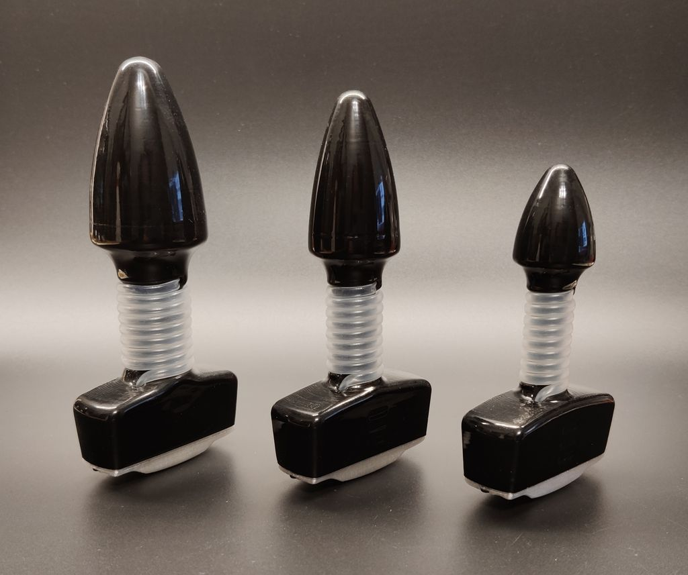

# SmartAss Plug - A Smart Butt Plug

Everything becomes "smart" these days. And there is no exception for butt plugs. While many butt plugs claim "smartness", just connecting it to the internet typically only means a remote control with more range. However **SmartAss Plug** has some more tricks up its sleeves. It's main purpose is not to vibrate a butt, but to sense and gauge sexual arousal. Having a reliable way to measure sexual arousal and orgasms opens up many possibility for the kinky minded person. Pneumatic anal probes have long time being the preferred choice in the clinical sector. However, in the kinky maker space the inflatable butt plug has gained more traction. Not least because of open source projects like the [nogasm](https://github.com/nogasm/nogasm) and the [protogasm](https://github.com/night-howler/protogasm). However, the inflatable butt plug suffers from a really bad signal to noise ratio. **SmartAss Plug** tries to build on these groundwork adding a more reliable sensor element, a more robust clench detection algorithm utilizing a kalman filter and calculus. All in a self-contained unit doing away any trip wires. In order to control a pleasure inducing device it connects to [XToys](https://xtoys.app/) or [buttplug.io](https://buttplug.io/) / [infitface](https://github.com/intiface/intiface-central).

Naturally it vibrates, too (kind of a the minimum requirement, obviously) and comes with more fun like a 9-DoF IMU and RGB Leds. Because, why not?

And last but not least, you are finally able to serve a website straight from your ass. How far has humanity come?

## Features

- Measures the involuntarily clenches of the pelvic floor to derive the arousal level of the wearer.
- Arousal classifier with the states "neutral", "aroused", "edging" or "orgasm".
- Vibration motor (plug sizes S & M only) for feedback, cheating in chess or stimulation.
- 9-DoF IMU to determine the absolute position of the plug for position training. (Not implemented, yet)
- Connects to your Wi-Fi or creates its own access point.
- Internal webserver to serve you the user interface straight from your butt.
- The inevitable RGB-led to make your butt shine colorful.
- Open WebSocket based API to integrate with your projects. (XToys and Buttplug.io support are pending)

## F.A.Q.

### What is the benefit of the coiled tube over an inflatable butt plug?

Using an inflatable butt plug is the traditional approach for edging and orgasm detection as introduced by the original nogasm. However, using this comes with some notable downsides. For some the size of these plugs can be daunting. Also the inflated portion - which is the actual sensor - sits behind the anal sphincter most of the time. As the signal we are looking for is the involuntarily clenching of the pelvic floor, the signal to noise ratio of an inflatable butt plug is not that great. It does pick up a lot of noise like breathing or even the heart beat. These signals can falsely trigger the algorithm leading to unsatisfying results. The coiled silicone tube sits exactly where the clenches happen resulting in a much cleaner signal to start with.

### Where can I buy this?

So far you can't buy it. You need to build it yourself sourcing all the required materials on your own. Consult the [sourcing guide](MakeIt/sourcing.md) for more information.

### Does it integrate with XToys or Buttplug.io?

SmartAss Plug offers a WebSocket API which makes it easy to integrate. XToys and Buttplug.io support is planned, but not implemented, yet.

### Is it available in different sizes?

Yes, the plug is available in 3 different sizes to accommodate a wide range of tastes.

|  Size  | Vibration | Diameter |
| :----: | :-------: | :------: |
| **XS** |    No     |  25 mm   |
| **S**  |    Yes    |  30 mm   |
| **M**  |    Yes    |  38 mm   |

## Contributors and Sources of Inspiration

- **Rudolf**, who came up with the [coiled silicone tube](https://www.thingiverse.com/thing:3543727) as sensor element and even has written a [scientific paper](https://www.degruyter.com/document/doi/10.1515/pjbr-2020-0014/pdf) on that topic.
- **Rhobot** with the original [nogasm project](https://github.com/nogasm/nogasm)
- **Onwrikbaar** with his bullfrog, who refined the simple [nogasm algorithm](https://github.com/Onwrikbaar/Bullfrog) with a peak summation and decay function.
- **night-howler** who contributed a breadboard friendly version of the nogasm called [protogasm](https://github.com/night-howler/protogasm).
- **Maus-Tec** who manufactures and sells the [Edge-O-Matic](https://github.com/MausTec/edge-o-matic-3000)
- **Skier23** who curates a [repository](https://github.com/Edging-Machines/Edging-Machines) and [discord](https://discord.gg/EvYbZBf) with all information regarding the topic.
- **Alex-R&D**

## License

Copyright &copy; 2023 by <a href="https://github.com/theelims"  target="_blank" rel="noopener">elims</a>

All work - software and hardware - is licensed under the

Creative Commons Attribution-ShareAlike 4.0 International Public License\*\*

For a full text of the license visit [CC-BY-SA 4.0](https://creativecommons.org/licenses/by-sa/4.0/).

# For further information visit the [project site](https://theelims.github.io/SmartAssPlug/).
