# Assemble the Plug

{ width="480" }

Assembly of a SmartAss Plug is not difficult. But take your time and do the steps with care to achieve the optimal result.

## Installing the Vibration Motor

!!! info "This chapter does not apply for the SmartAss Plug XS"

    The SmartAss Plug XS does not feature a vibration motor. You can omit this step and continue with vapour smoothing.

As a very first step check wether the tip fits nicely on the plug. By slightly screwing the tip on it should stick without leaving a visible gap. If your seems are noticeable, sand them on the inside and the outside of the conus.

{ width="480" }

Soldering around 20-30 cm of silicone wire onto the motor terminals of the vibration motor. The polarity or the color of the wires doesn't matter. Carefully thread the wires one-by-one through the center hole into the main body.

{ width="480" }

Press the motor into the press-fit of the plug. This requires some force. If not, then you should consider working on your printers dimensional accuracy and reprint the part. The housing of the motor should only sick around 1-2 mm out of the plug's body.

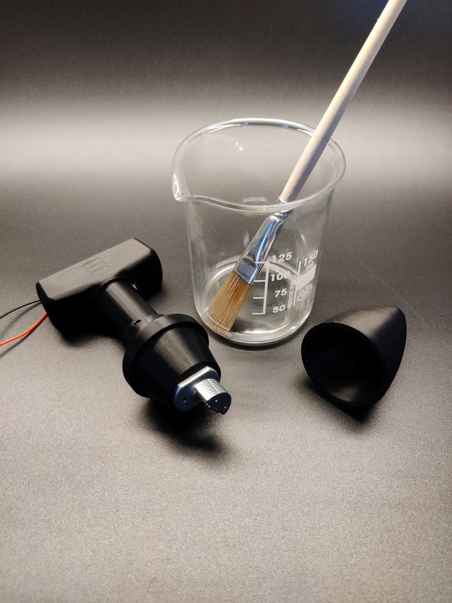{ width="480" }

Prepare the weld by preparing some acetone and a acetone-proof brush. ASA and ABS can be welded by dissolving the surface with acetone. This weld is extremely strong and destructive testing showed, that it is impossible to destroy.

!!! warning "This will only work if you have printed the parts in ASA or ABS"

    If you've printed your plug in an other material check what kind of solvent you need to do the weld. Glueing should be possible as well, but won't lead to nice results.

!!! danger "Welding is a critical step!"

    The acetone evaporates rather quick. The parts must be pressed on wet on both sides of the cone. Work quickly and accurate. Rework is not possible once it is welded.

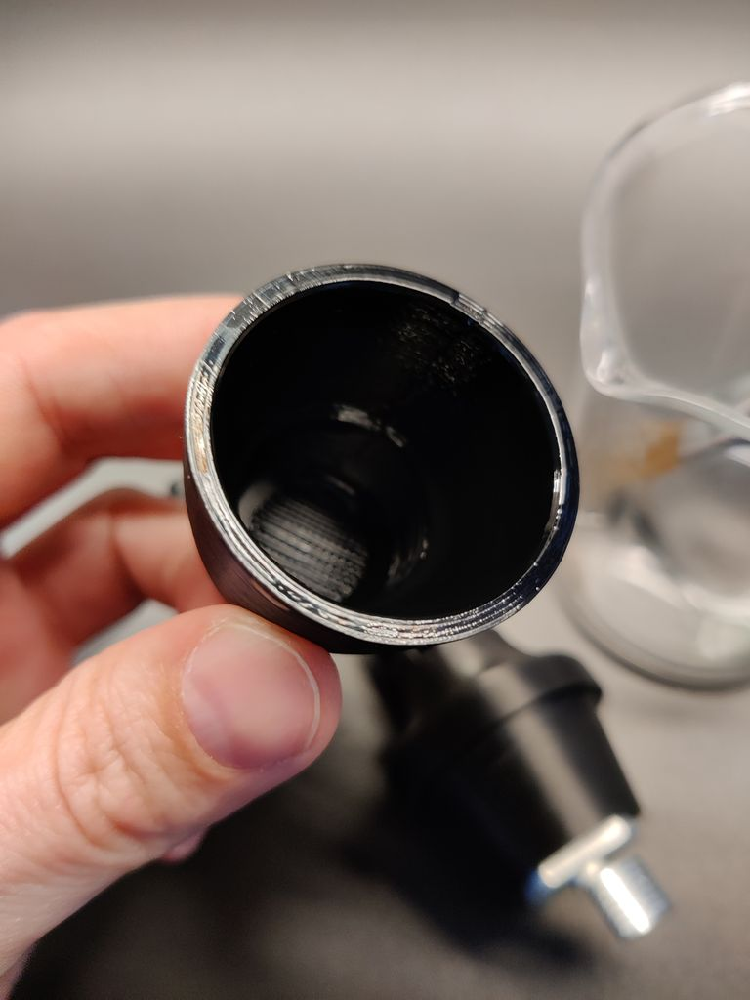 
 

Apply the acetone on both, inside and outside of the cones. Work quickly, as the acetone evaporates fast. Add a second or third round of acetone if needed. The parts must be pressed together wet in wet. Don't mind if the acetone will run onto other parts of your print. This will be taken care of during post processing.

{ width="480" }

Press the tip on the plug with as much force as possible. A twisting motion will distribute molten plastic inside the seam and fill the gaps. The ideal seam will noticeably bulge.

{ width="480" }

Once the weld has solidified you can start sanding away the seam with sandpaper. Start with 120 grid and work towards finer grids.

## Vapour Smooth the Plug

!!! warning "This will only work if you have printed the parts in ASA or ABS"

    If you've printed your plug in an other material check what kind of solvent you need to do the polishing. Or you need to do the post processing completely manual.

!!! danger "Acetone is Dangerous!"

    Acetone is a dangerous chemical. It is highly inflammable and can lead to explosives atmospheres. Read the MSDS that comes with your bottle of acetone. Do the vapour smoothing only in a well ventilated area, preferably outside. Take precautions and keep away any ignition source (electronics, fire, heater, ...)

For an optimal, high-gloss, germ friendly and watertight finish the plug must be polished with acetone fumes. For optimal results you should sand away the layer lines.

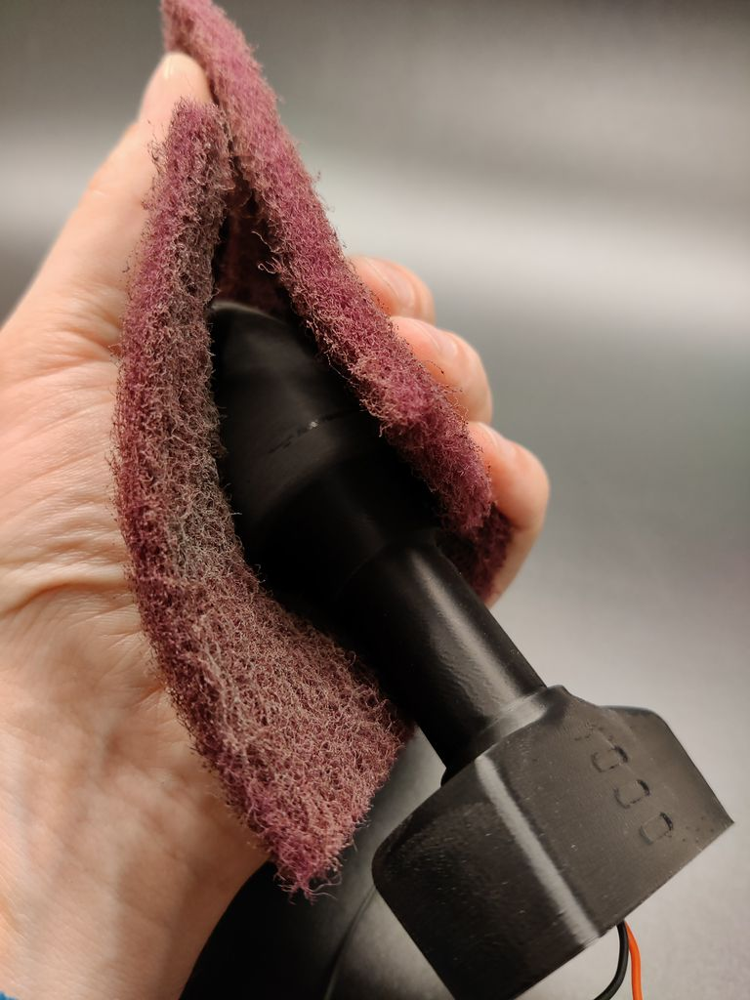 
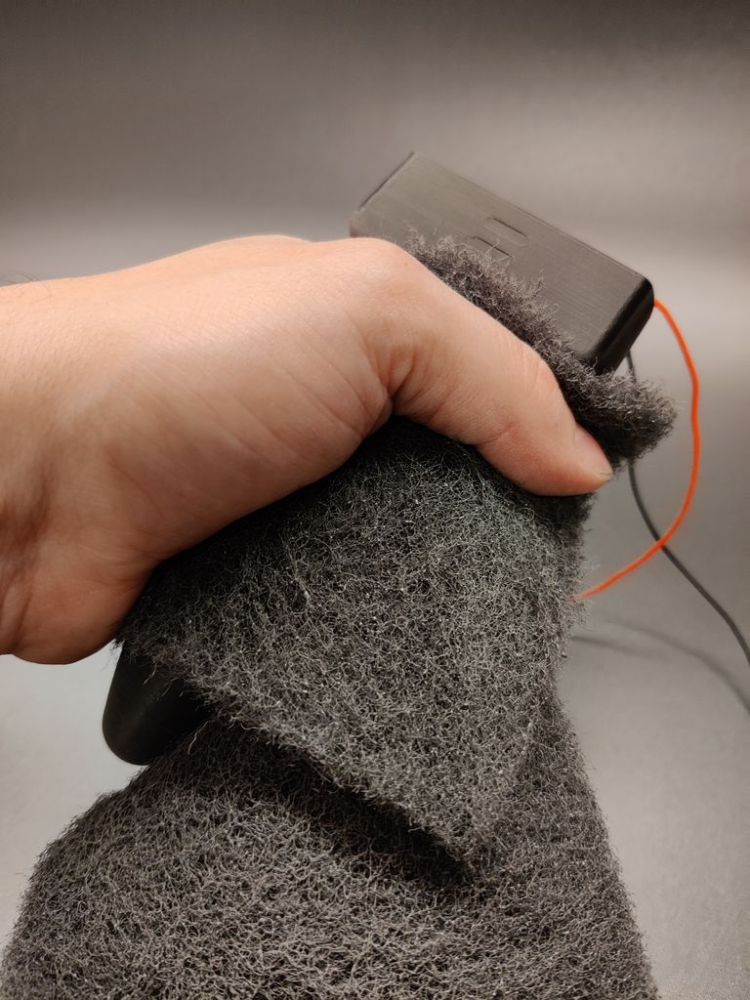 

Start with fine sandpaper and continue with the scotch-brite. First the red, medium coarse. And finally the black fine non-woven. Take your time for this step. The better the layer lines disappear, the better will be the polished results.

Remove any dust and finger prints from sanding with IPA and a lint-free cloth. If you have a plug with vibration motor stow away te excess cables inside the electronics compartment.

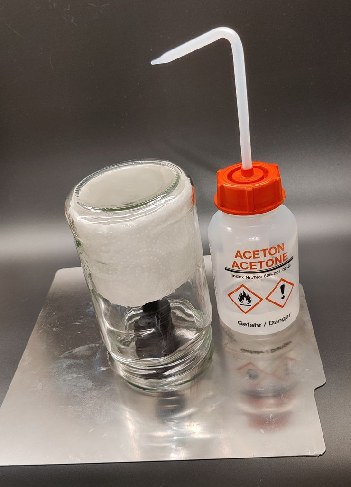{ width="480" }

Use a pickles jar big enough to contain the whole plug. Inside the jar place some paper towels to hold the acetone. This should be at the very top of the jar, so that the acetone vapour concentration is also up there. Wet the paper towels with acetone. Make sure that you do not over-saturate them. There should be no acetone running down the sides.

Place the plug on a acetone proof surface like a metal build plate and let the vapour do its magic. Depending on the temperature and the filament brand this can take up to 30-60 minutes.

!!! tip "Test the process with a benchy"

    Test how your particular filament brand smooth with some excess benchies.

Once the time is up remove the jar and let the plug dry. Do not touch the plug until it's fully solidified again. Properly discard the acetone and let it evaporate outside.

## Install the Silicone Tubing

{ width="480" }

To install the silicone tube which serves as the pressure sensor you'll need a fine tipped tweezer. The installation is a little bit fiddly, but with the right tricks not that hard.

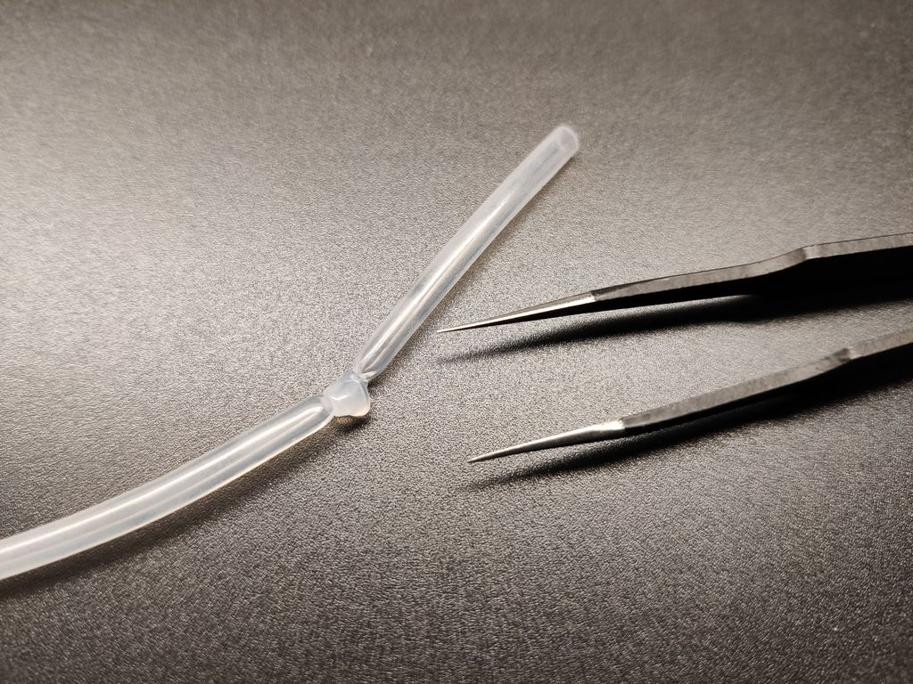 
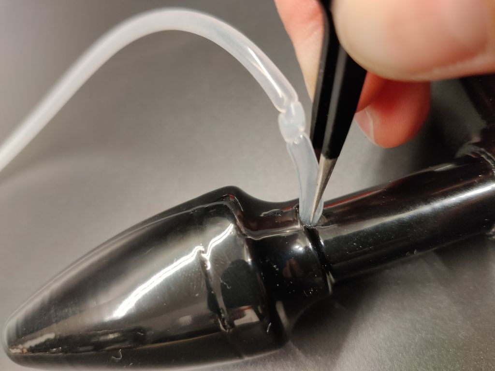 

Start by making a single knot 5-6 cm away from the tube end. Pull the knot really tight. It will seal the one end of the tube. Use the tweezers to push the short end into the hole where the tube will later exit to form the coil. Inside that hole there is a special cavity for the knot. Try to push the tube as deep inside the cavity as possible.

!!! warning "Don't Damage the Tube"

    These tweezers are quite sharp and easily puncture the tube. Be especially cautious.

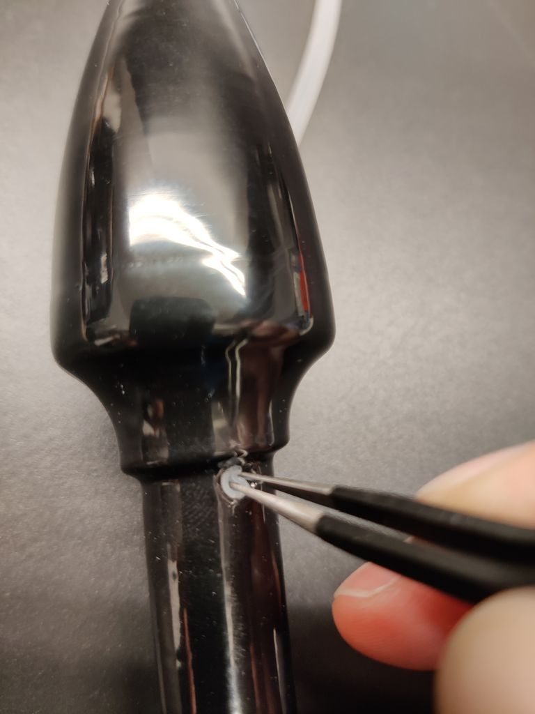 
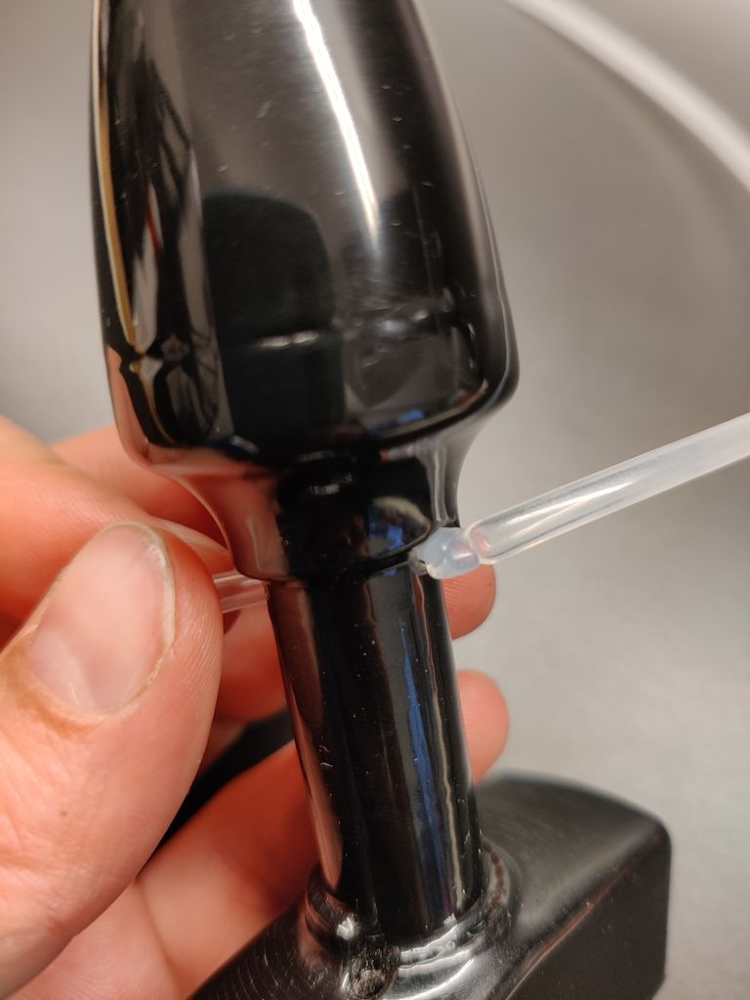 

Then try to grab the end of the tube from the other side (this hole will be hidden later) and pull it through. Gently pull it until the knot is at the hole. Then try to pull the knot inside the cavity. This requires some force and most likely it will snap right through and exit on the other side. Don't panic. Pull it gently back into the cavity, while holding the short end under tension. With this trick the knot will stay safely inside the plug.

{ width="480" }

Finally wrap the tube around the shaft of the plug. Apply a slight tension so that the winding is tight and compact. Finally thread the remaining tube through the bottom hole. Use the tweezers to assist in the task.

## Mount the PCB

{ width="480" }

Cut the vibration motor wires to around 30-40 mm measured from where the leave the shaft. Solder them to one set of motor pads. You can use either of the motor solder pads.

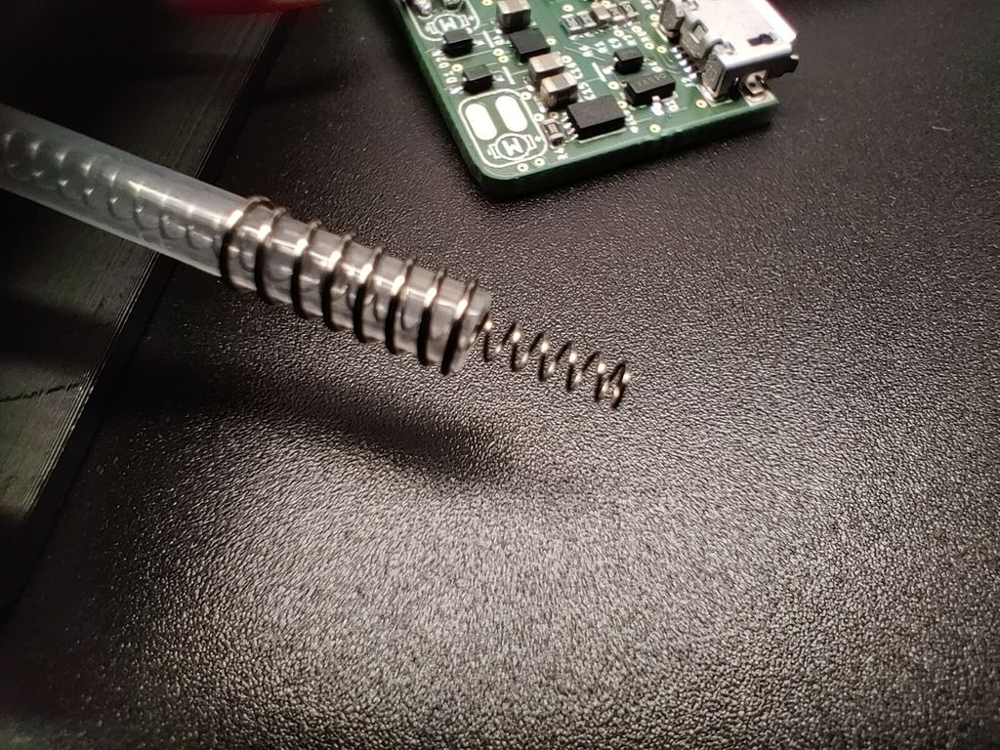 
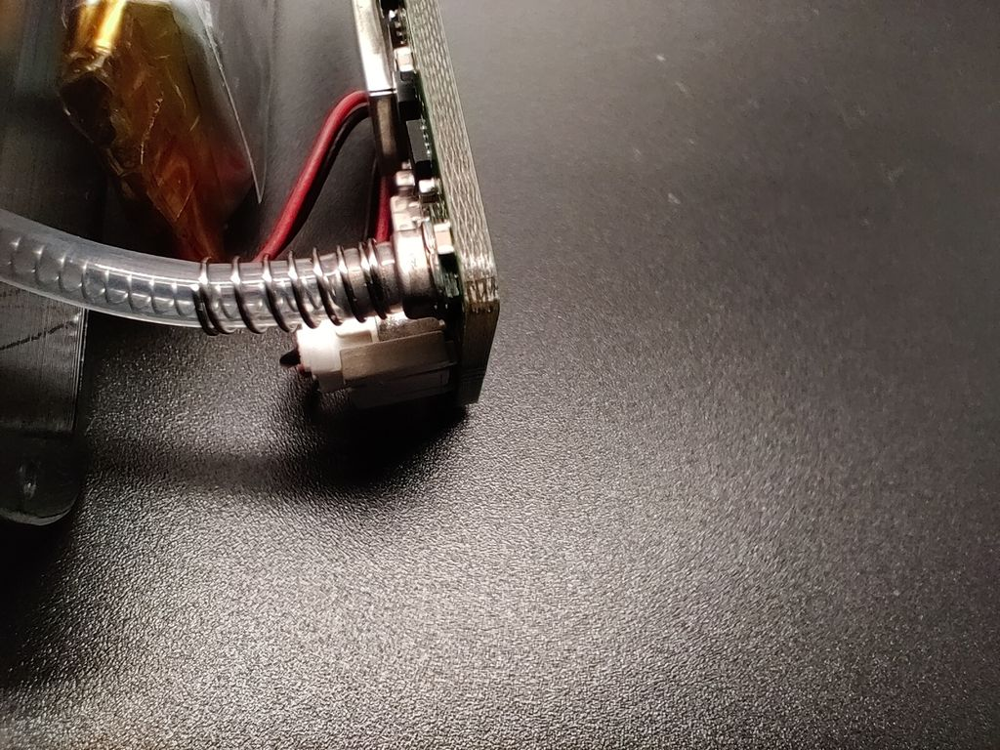 

!!! warning "The Springs are Mandatory"

    These springs are extremely important for the plug to work properly. The silicone tube is very thin walled and kinks easy in bends. Inside the electronics compartment it is very tight and the tube needs well defined bends. The springs will prevent the walls of the tube from collapsing. If you leave the springs out the probability is very high, that your plug won't work.

Cut the silicone tube to 40 mm measured from where it enters the electronics compartment. Push the 2 mm x 45 mm spring into the tube. It should stick out 3-5 mm when completely pushed in. If you've cut the tube too short, you can massage a few millimeters out of the coil. It is important, that the inner spring has some compression. Push the 4 mm x 10 mm outer spring over the tube, so that it sits flush with the bottom.

Then press the tube and springs over the port of the pressure sensor. The outer spring serves both as a retainer clip, as well as a kink protection for the very tight bend right after the sensor.

{ width="480" }

Install the battery in the connector. Check the polarity of your battery with the **+** and **-** symbols on the PCB's silkscreen. If your battery has a reversed polarity use a thin needle to remove the crimp connectors out of the plug and push them in in the right order. Don't short the battery in the process.

!!! danger "Double Check the Polarity of the Battery"

    **Failing to do so will inevitably damage your PCB!** There is no reverse polarity protection for the battery.

Gently slide the PCB into the recess of the plug's body. The silicone tube will twist itself in in the exact right way.

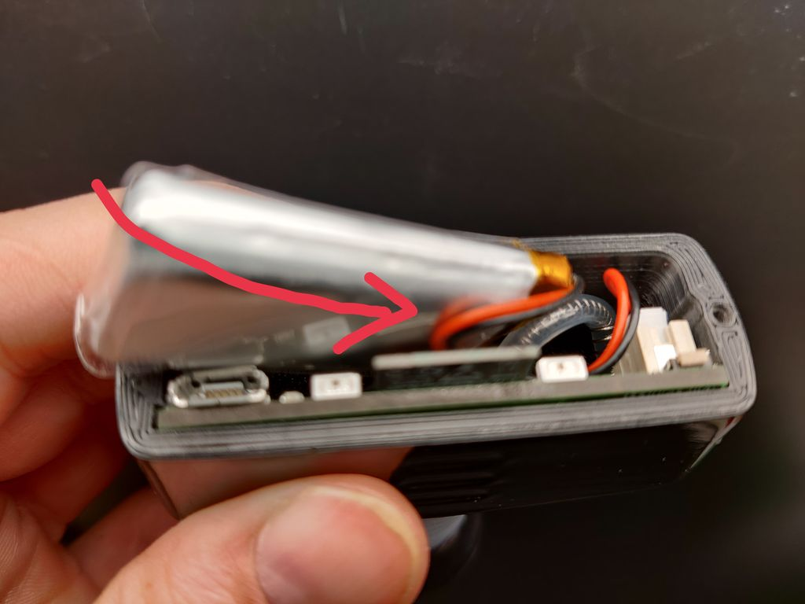{ width="480" }

Install the battery as shown in the picture. The part with the protection PCB must go to the battery connector side giving room for the silicone tube. If the wires of the motor get in your way, or get stuck under the battery use tweezers or a screwdriver to position them between the ESP's shield and the battery. Same goes for the wires of the battery itself.

{ width="480" }

The final result should look like this. The wires for the motor and the battery should fit between battery and the PCB. Last but not least mount the transparent cap with the two screws and start charging the battery.

{ width="480" }

Take a moment and enjoy the results of your hard work. Your plug is ready to receive the firmware now.
